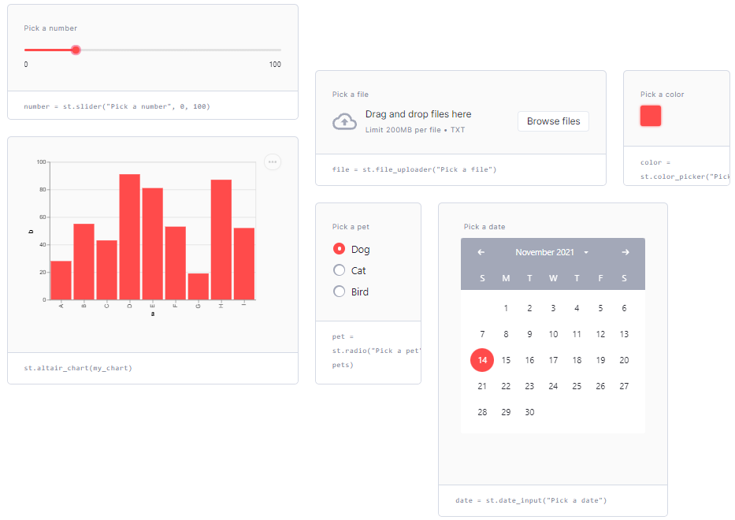
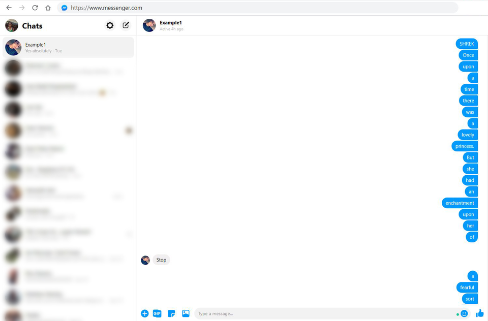

# Python Projects

The following projects are useful for getting familiar with python.

For AI/ML projects it's recommended to have basic python experience.

## Simple streamlit dashboard

Description: Streamlit is an extremely simple tool for building interactive data visualisation web apps. Very useful for interacting with AI models and building demos. You can use it to build anything you want, for example gitub profile activity dashboard or statistics dashboard for your twitter account. See the examples from official gallery: https://streamlit.io/gallery

**Difficulty: 2/5**

Recommended libraries: ?

## Swarm simulation - organic motion from 3 simple rules

Description: Also called "flocking".

**Difficulty: 3/5**

Algorithm explanation: https://www.youtube.com/watch?v=bqtqltqcQhw

Recommended libraries: OpenCV. See the **[example code](.resources/BOIDS_CODE.md)**.

Resources:
?

## A tool for fast image cropping

Description: A tool for fast image cropping.

**Difficulty: ?**

Recommended libraries: ?

## Program operating on a script of a movie

Description: A program that sends your friend an entire script of shrek movie word by word.

**Difficulty: 1/5**

Recommended libraries: ?

## Small project ideas

http://inventwithpython.com/bigbookpython/

